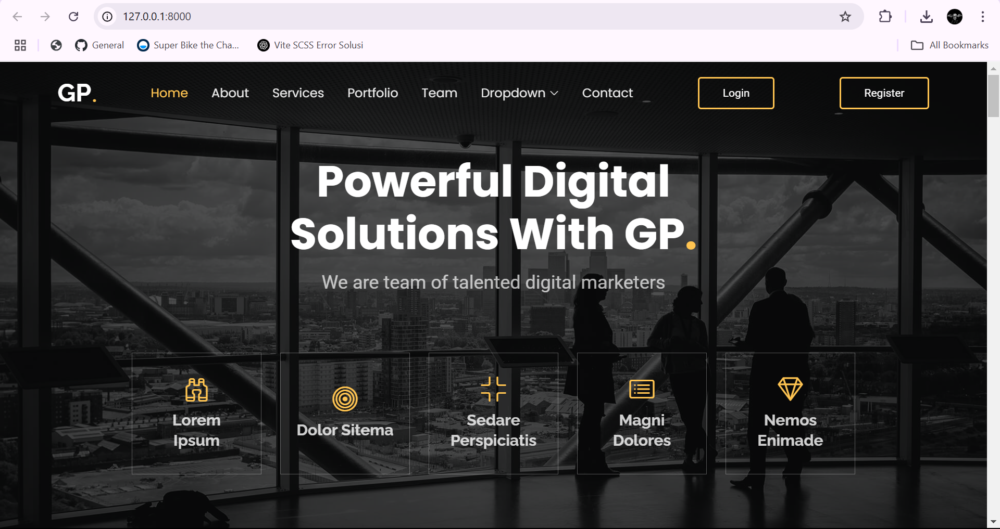
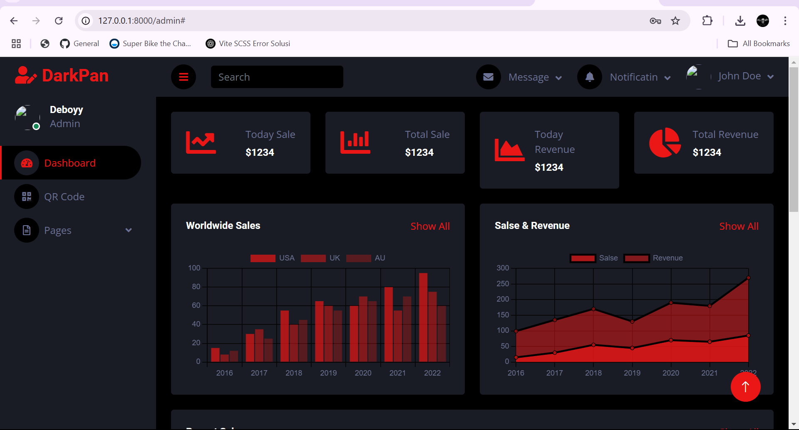
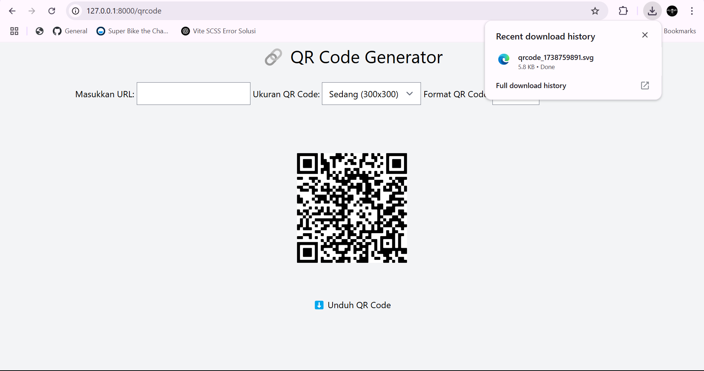

## About Laravel

Laravel is a web application framework with expressive, elegant syntax. We believe development must be an enjoyable and creative experience to be truly fulfilling. Laravel takes the pain out of development by easing common tasks used in many web projects, such as:

- [Simple, fast routing engine](https://laravel.com/docs/routing).
- [Powerful dependency injection container](https://laravel.com/docs/container).
- Multiple back-ends for [session](https://laravel.com/docs/session) and [cache](https://laravel.com/docs/cache) storage.
- Expressive, intuitive [database ORM](https://laravel.com/docs/eloquent).
- Database agnostic [schema migrations](https://laravel.com/docs/migrations).
- [Robust background job processing](https://laravel.com/docs/queues).
- [Real-time event broadcasting](https://laravel.com/docs/broadcasting).

Laravel is accessible, powerful, and provides tools required for large, robust applications.
## QR Code Generator - Laravel

QR Code Generator adalah aplikasi web berbasis Laravel yang memungkinkan pengguna untuk membuat QR Code dengan mudah. Pengguna cukup memasukkan URL yang ingin dijadikan QR Code, memilih ukuran dan format QR Code, dan kemudian aplikasi akan menghasilkan QR Code sesuai dengan preferensi pengguna. Selain itu, QR Code yang dihasilkan dapat langsung ditampilkan di halaman web atau diunduh dalam format yang diinginkan, seperti SVG ataupun PNG.

Ini sangat berguna bagi siapa saja yang membutuhkan QR Code untuk kebutuhan, seperti untuk berbagi link URL yang berisi dokumen tanda tangan digital didalamnya atau lainnya dengan cara yang mudah diakses dan praktis.

## Fitur Utama
- **Generate QR Code**: Memungkinkan pengguna untuk membuat QR Code dengan hanya memasukkan URL.
- **Pilih Ukuran**: Pengguna dapat memilih antara tiga ukuran QR Code (Kecil, Sedang, Besar).
- **Pilih Format**: Pengguna dapat memilih format file QR Code yang dihasilkan (SVG ataupun PNG).
- **Unduh QR Code**: QR Code yang dihasilkan dapat langsung diunduh dalam format yang dipilih.

## Sumber
https://github.com/SimpleSoftwareIO/simple-qrcode/tree/develop/docs/en

## Teknologi yang Digunakan
- **Laravel**: Framework PHP yang digunakan untuk membangun aplikasi ini.
- **simple-qrcode**: Library Laravel yang digunakan untuk membuat QR Code secara mudah.
- **Laravel Breeze**: Autentikasi untuk untuk login, registrasi, reset password, dan verifikasi email.
- **Blade**: Template engine Laravel yang digunakan untuk membuat tampilan aplikasi.
- **Tailwind CSS**: Framework CSS yang digunakan untuk styling dan membuat tampilan responsif.

## Tujuan Proyek
Proyek ini dibuat untuk memenuhi Kuis/Tugas dari mata kuliah Kriptografi dan juga akan melakukan pengembangan yang lebih baik untuk kedepannya

## Screenshot

Berikut adalah tampilan antarmuka aplikasi QR Code Generator:

### Tampilan Landing Page

### Tampilan Dashboard

### Tampilan Form QRCode dan hasil Unduh nya
Pada contoh QRCode di tampilan ini saya gunakan URL dari sebuah PDF yang berisi data diri dan tanda tangan digital, kemudian saya melakukan upload ke google drive. Tujuan nya agar PDF nya memiliki URL yang nantinya akan di generate ke QRCode

## Lisensi

Aplikasi ini dilisensikan di bawah MIT License. Lihat [LICENSE](LICENSE) untuk detail lebih lanjut.

